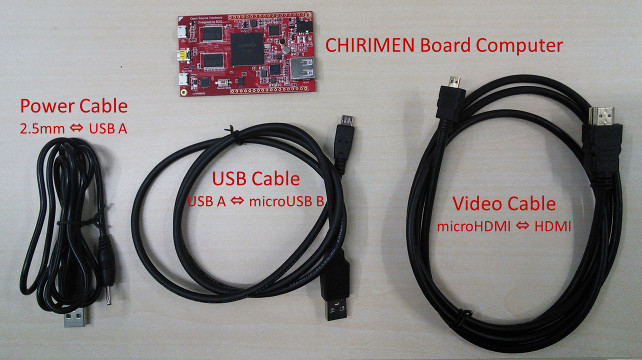
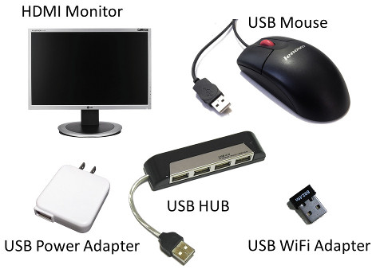

# Startup section

## Introduction
This section verifies a startup of CHIRIMEN and the basic operation as a web browser.

## Required equipments
Following hardwares are required to perform the basic operations:  

- CHIRIMEN board computer
- HDMI monitor (In order to display the output of CHIRIMEN )
- HDMI cable (It is attached to the typical CHIRIMEN package. )
- USB power cable for CHIRIMEN  (It is attached to the typical CHIRIMEN package. )
- USB power source with the electric-current supply capacity of more than 1A is required
- USB mouse

### Required equipments for WiFi connection (Optional)
In addition, the following is required for the application which connects CHIRIMEN to World-Wide Web.

- USB WiFi adapter
  - The chipsets which may operate are RTL8188CUS or RTL8188RU or RTL8192CU. (Confirmation required)   (confirm list item of operation) 
- USB HUB

### The image of equipments
The following board and cables may be enclosed by the package of typical CHIRIMEN.
 

The image of required additional equipments is attached below.
 

## Connection diagram
The connection diagram of a hardware is as follows.
 

The way it will be connected has been shown in the following picture.

 

## The sequence for starting (boot-up)

- Fix a CHIRIMEN board on a non-conductor.
- Please make all the connection except a USB power source as a connection diagram.  
Besides, when not trying WiFi, you may connect a mouse to a USB HOST terminator directly.
- Please switch on HDMI monitor's power.
- Finally please switch on a USB power source.
- After the startup screen of Boot to Gecko OS appears, the desktop screen of Boot to Gecko is displayed after a while.

The confirm of the basic operation was completed.