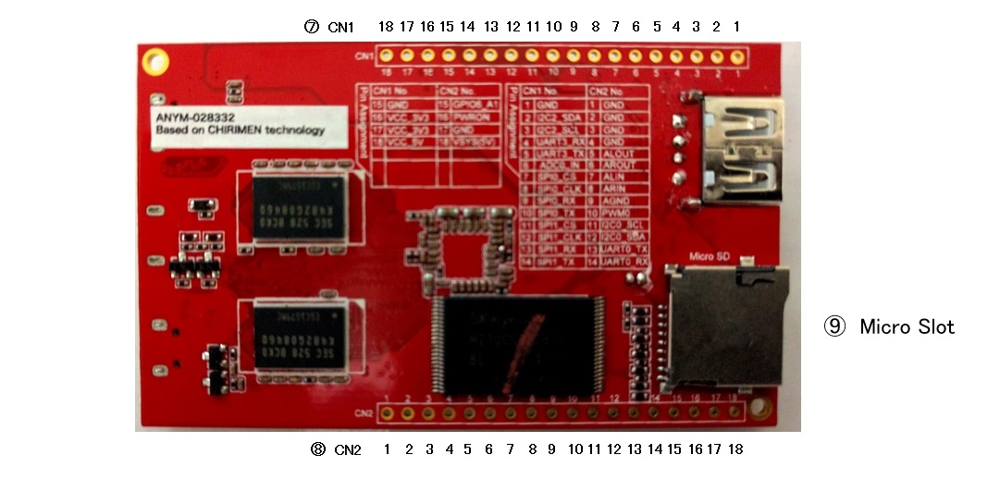

# Layout of the connectors
This section introduces the layout of connectors and  switch of a CHIRIMEN board computer. 

## Layout of connectors

 

 

1. USB OTG  
It is a USB port of MicroUSB Type B used to connect the host computer for a development.
1. Micro HDMI type video connector  
It is a connector for connecting a HDMI video monitor.
1. USB UART  
This connector is not used in many cases. The signal converted into USB from the UARTx port which SoC carries is outputted here.
1. 5V power in  
It is a power supply connector of 5V with external diameter of 2.5mm.
1. USB HOST  
It is a USB Type A port for connecting a network adapter, a pointing device, etc.
1. Recover mode switch  
It is a switch mainly used for updating an OS.
1. CN1 (Connector1)  
It is a multi use input-and-output-terminal group of the through hole where signals, such as GPIO, I2C, universal synchronous-asynchronous receiver-transmitter and SPI were collected. Refer to the next chapter for the signal layout of this connector.
1. CN2  (Connector2)  
It is another multi use input and output terminal group.
1. Micro SD Slot  
It is a MicroSD slot. It is not supported by OS as of February, 2016.

## Pinout of multiuse I/O terminals
Multiuse I/O (CN1 and CN2) is 
- Through Hole
- Pitch : 2.54mm
- GPIO voltage : 3.3V

If you have not soldered any pins onto a CHIRIMEN yet, a jumper wire for Through Hole (e.g. [TTW-200](https://www.amazon.co.jp/%E3%82%B5%E3%83%B3%E3%83%8F%E3%83%A4%E3%83%88-TTW-200-%E3%82%B9%E3%83%AB%E3%83%9B%E3%83%BC%E3%83%AB%E7%94%A8%E3%83%86%E3%82%B9%E3%83%88%E3%83%AF%E3%82%A4%E3%83%A4/dp/B00J7LFHVU) ) is recommended for test use.

Note: Currently UART, SPI and PWM are re-assigned to GPIO.

||CN1 (Connector1)| |CN2 (Connector2)|
|------------|:--:|:----------:|:----------------:|
|Number|Description (sysfs name)| |Description (sysfs name)
|1|GND| |GND|
|2|I2C-2 SDA| |GND|
|3|I2C-2 SCL| |GND|
|4|GPIO-3 D3 (gpio283)| |GND|
|5|GPIO-3 D4 (gpio284)| |Audio L out|
|6|ADC-0 in| |Audio R out|
|7|GPIO-1 A4 (gpio196)| |Audio L in|
|8|GPIO-1 A5 (gpio197)| |Audio R in|
|9|GPIO-1 A6 (gpio198)| |Audio GND|
|10|GPIO-1 A7 (gpio199)| |GPIO-0 A3 (gpio163)|
|11|GPIO-1 C4 (gpio244)| |I2C-0 SCL|
|12|GPIO-1 C3 (gpio243)| |I2C-0 SDA|
|13|GPIO-1 C6 (gpio246)| |GPIO-0 A1 (gpio193)|
|14|GPIO-1 C5 (gpio245)| |GPIO-0 A0 (gpio192)|
|15|GND| |GPIO-6 A1 (gpio353)|
|16|VCC 3.3V| |Power ON|
|17|VCC 3.3V| |GND|
|18|VCC 5V| |VSYS 5V|

<!-- (ORIGINAL) 
||CN1 (Connector1)| |CN2 (Connector2)|
|------------|:--:|:----------:|:----------------:|
|Number|Description| |Description
|1|GND| |GND|
|2|I2C-2 SDA| |GND|
|3|I2C-2 SCL| |GND|
|4|UART-3 RX| |GND|
|5|UART-3 TX| |Audio L out|
|6|ADC-0 in| |Audio R out|
|7|SPI-0 CS| |Audio L in|
|8|SPI-0 CLK| |Audio R in|
|9|SPI-0 RX| |Audio GND|
|10|SPI-0 TX| |PWM-0|
|11|SPI-1 CS| |I2C-0 SCL|
|12|SPI-1 CLK| |I2C-0 SDA|
|13|SPI-1 RX| |UART-0 TX|
|14|SPI-1 TX| |UART-0 RX|
|15|GND| |GPIO-6 A1|
|16|VCC 3.3V| |Power ON|
|17|VCC 3.3V| |GND|
|18|VCC 5V| |VSYS 5V|
-->
