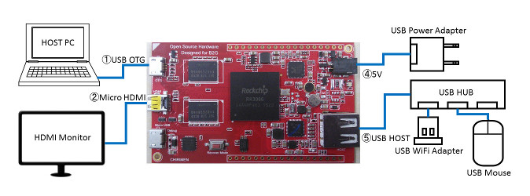

# Development-environment preparation section windows version

## Introduction
The current CHIRIMEN is a Boot to Gecko OS based board computer. Then, its development environment is one for B2G based computer. It uses WebIDE carried in Firefox on host PC.  Furthermore, ADB (Android Debug Bridge) on host PC is used as supplement. Therefore, Firefox WebIDE and ADB on host PC must be able to recognize CHIRIMEN.

## Required equipments
In addition to all the equipments used by startup section, the following is required for a hardware element necessary for this development environment.

- Windows PC (7 or later are recommended)
- USB cable (It is attached to a typical CHIRIMEN package)

### Hardware connection diagram
 

## Software which should be installed in host PC
- Firefox
  - ADB Helper addon
  - Tool adapter addon
- ADB(Android Debug Bridge) tool
  - Java (JRE is also OK. )
  - Android SDK Tools (The manager for installing an ADB tools)
- USB driver for CHIRIMEN
  - In Windows 10 Ver.1511, it is equipped beforehand.
  - In earlier versions of Windows, it can be installed using DriverAssistant_v4.1.1.zip.
  
## Step by step guide
Here, an installation procedure is explained.

### Installation of a USB driver
- Launch the device manager of Windows.
- Boot up the CHIRIMEN（based on startup section）
- connect CHIRIMEN to host PC through USB.
- Windows10 Ver1511 or higher
  - CHIRIMEN is automatically recognized as USB Device. (Check by the device manager.)
- Other Windows
  - In a device manager, "other device/CHIRIMEN" appears as a device in which the device driver is not installed.
  - Download and unpack [DriverAssistant_v4.1.1.zip](https://github.com/MozOpenHard/CHIRIMEN-tools/blob/master/DriverAssistant_v4.1.1.zip).
  - Choose CHIRIMEN as a device in which the device driver is not installed by a device manager and update a driver.
  - By choosing the folder (and the subfolders) ,mentioned above and installing a driver, it is recognized as Android Device /Android Composite ADB interface.

### Install ADB (Android Debug Bridge).
- Install JDK (at leaset JRE) ( [This](http://www.oracle.com/technetwork/java/javase/downloads/index.html) or [this](https://java.com/ja/download/) )
- Install Android SDK Tools Only (Android Studio is more than necessary)  
Android SDK Tools Only is Other [Download Options section](http://developer.android.com/sdk/index.html#Other).
- Launch SDK Manager  
Note: If you installed Andorid SDK for anyone, then you should launch SDK Manager as admin mode
- Install "Android SDK Platform-tools"
- Set the place of adb.exe of Platform-tools as PATH of Windows environment.
- Check the following operations.  
With a command prompt   If adb shell [ret], you can log in to CHIRIMEN.
  
### Make CHIRIMEN recognize by Firefox WebIDE.
Note: WebIDE controls CHIRIMEN using the function of ADB.  Therefore, please enable it to operate CHIRIMEN by ADB with the procedure to the preceding chapters.

- Launch Firefox and update it to the latest version.
- Choose a tool / development tool / WebIDE.
- Choose "install ADB Helper" under upper right  ”USB devices" item.   
And install following two addons.
  - ADB Helper addon
  - Tool adapter addon
- Re-launch Firefox
- Check the following operations.
  - CHIRIMEN appears on upper right ”USB devices" item of tool / development tool / WebIDE window
  - When the CHIRIMEN item is chosen, list of runtime apps etc. appears on the left-hand side of WebIDE window

Fundamental development environment was ready!

## References
- [Connecting a Firefox OS device to the desktop](https://developer.mozilla.org/en-US/docs/Mozilla/Firefox_OS/Debugging/Connecting_a_Firefox_OS_device_to_the_desktop)
- [Installing ADB and Fastboot](https://developer.mozilla.org/en-US/docs/Mozilla/Firefox_OS/Debugging/Installing_ADB)
- [Java(JDK)とAndroid SDKを導入してADBコマンドを使えるようにする](http://andmem.blogspot.jp/2014/04/installjdkandroidsdkadb.html)
