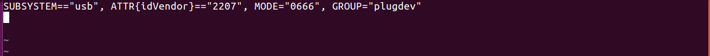
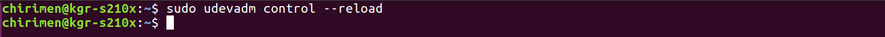
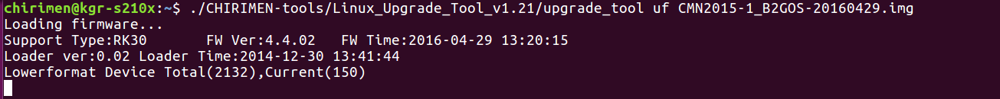
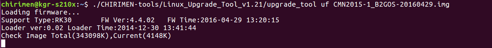
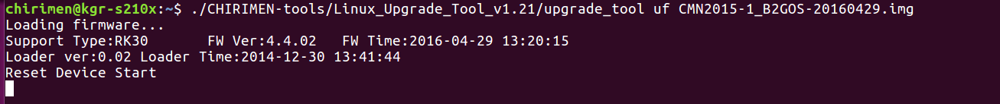

# Firmware Update Guide for Linux(Ubuntu)

## Outline
This page explains an update procedure for the operating system of a CHIRIMEN board computer . OS of host PC is Linux(Ubuntu).

## Required equipments
- CHIRIMEN Board Computer
- HDMI monitor (In order to display the output of CHIRIMEN )
- HDMI cable (It is attached to the typical CHIRIMEN package. )
- USB power cable for CHIRIMEN  (It is attached to the typical CHIRIMEN package. )
- USB power source with the electric-current supply capacity of more than 1A      

### Connection diagram


## Ubuntu version
- OS version is checked.

  ```
  $ cat /etc/lsb-release
  DISTRIB_ID=Ubuntu
  DISTRIB_RELEASE=16.04
  DISTRIB_CODENAME=xenial
  DISTRIB_DESCRIPTION="Ubuntu 16.04.1 LTS

  $ arch
  X86_64
  ```

## Step by step guide
Here, an installation procedure has been explained.

### Ubuntu Operation
- Booting terminal of Ubuntu.
- The following procedure is performed at an end (terminal) basically.


### CHIRIMEN-tools was cloned from github.
  ```
  $ git clone https://github.com/chirimen-oh/CHIRIMEN-tools.git
  ```
  

### Getting Newest image file.
- Excuting command.

  ```
  $ wget https://github.com/chirimen-oh/release/releases/download/CMN2015-1/CMN2015-1_B2GOS-2016XXXX.zip
  ```

  ```
  ※2016XXXX:Version
  ```
  


### Newest image file is deforeted.
- Excuting command.

  ```
  $ unzip CMN2015-1_B2GOS-2016XXXX.zip
  ```

  ```
  ※When zip file defrosted, file of CMN2015-1_B2GOS-2016XXXX.img is maked.
  ```

  ```
  ※2016XXXX:Version
  ```
  

### configuration of rules.
- rules file (51-android.rules) is configurated.
  - Excuting command.

    ```
    $ sudo vi /etc/udev/rules.d/51-android.rules
    ```
    
- rules file (51-android.rules) is edited.
  - input following context.

    ```
    SUBSYSTEM=="usb", ATTR{idVendor}=="2207", MODE="0666",GROUP="plugdev”
    ```
    

### Setting, reflected.
- Excuting command.

  ```
  $ sudo udevadm control --reload
  ```
  

### CHIRIMEN Board is connected to a PC and a display.
- A USB cable is connected to a PC in OTG and the connector printed out.
- A HDMI cable is connected to a PC in HDMI and the connector printed out.

### CHIRIMEN Board is bootin by write mode.
- Pressing Recover Mode Switch, Booting CHIRIMEN Board.

### CHIRIMEN Board is excuted by write mode.
- Excuting command.

  ```
  $ ./CHIRIMEN-tools/Linux_Upgrade_Tool_v1.21/upgrade_tool uf CMN2015-1_B2GOS-2016XXXX.img
  ```

  ```
  ※2016XXXX:Version
  ```
  
  
  
  
  

### Wating for CHIRIMEN Board reboot.
- An update process has been completed.

