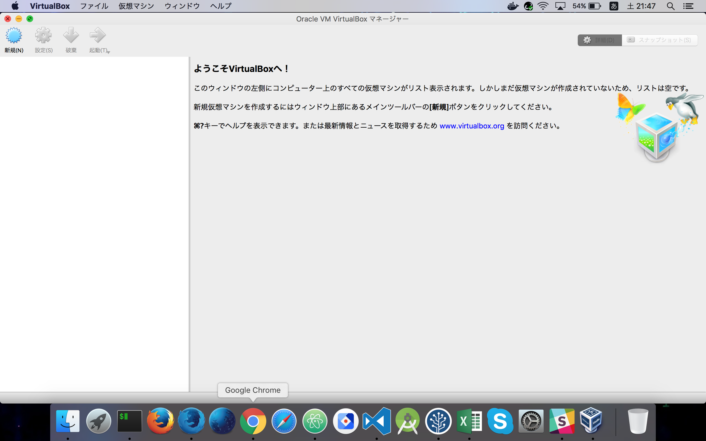
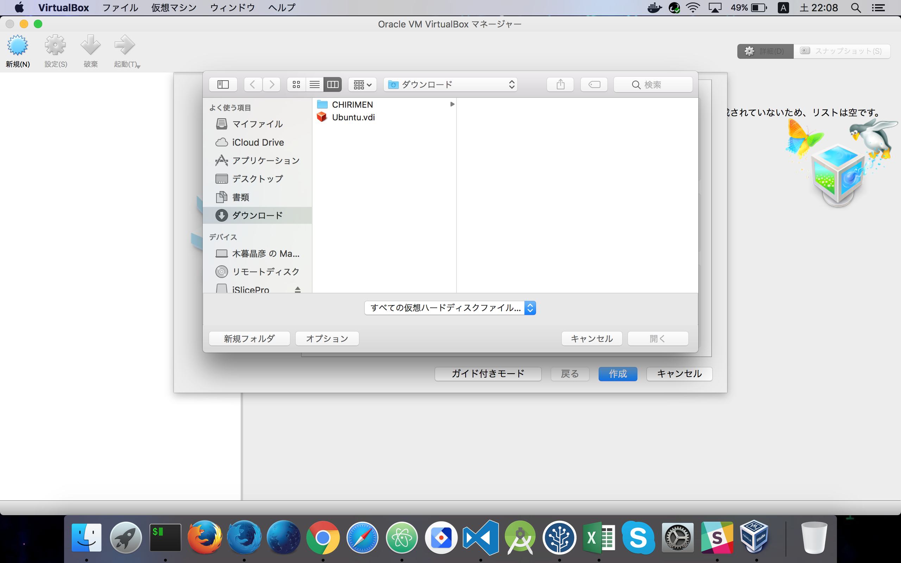
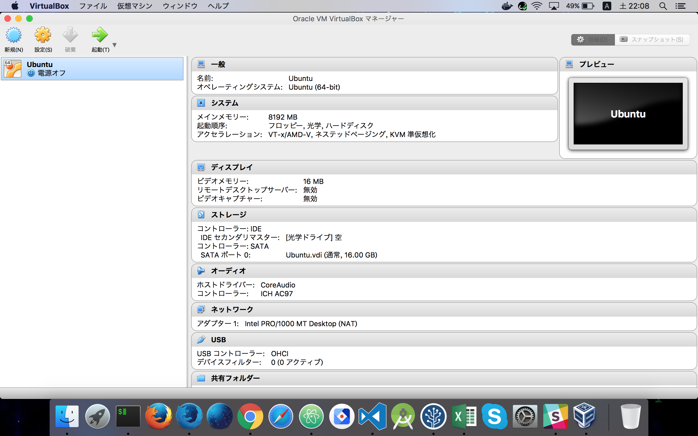
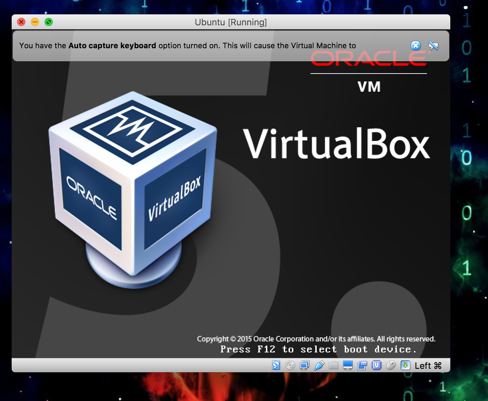
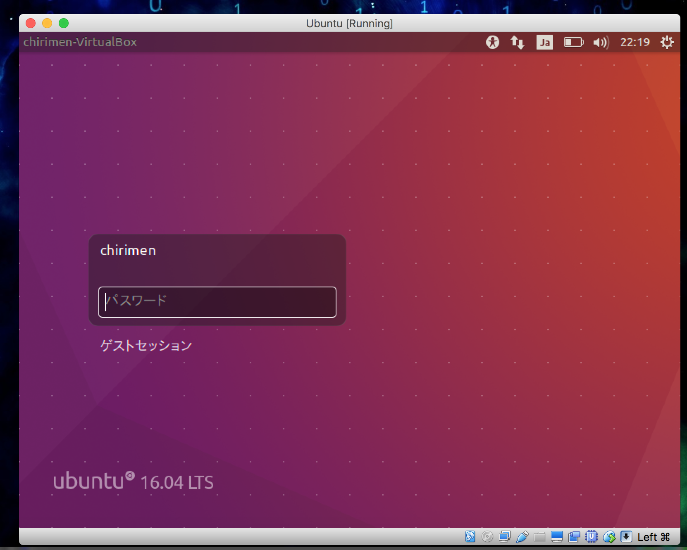
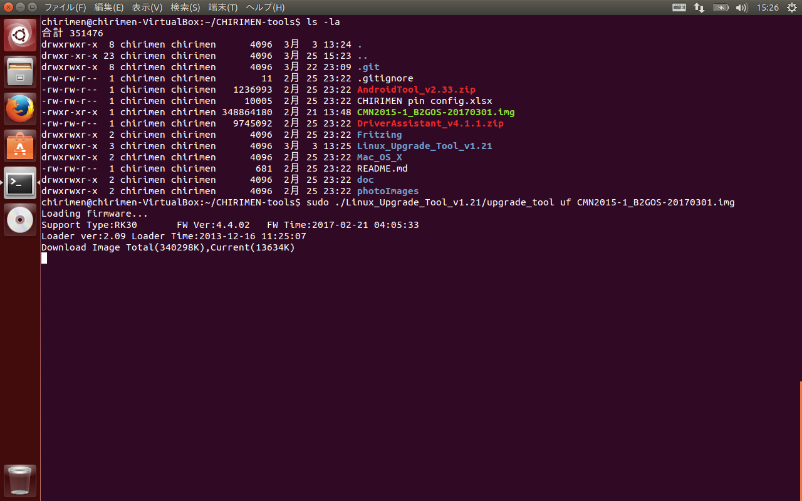

# Firmware Update Guide for mac(Virtualbox)

## Outline
This page explains an update procedure for the operating system of a CHIRIMEN board computer<br />
OS of host PC is macOS.<br />
Using by Virtualbox. Guest OS is Ubuntu.

## Required equipments
- CHIRIMEN Board Computer
- HDMI monitor (In order to display the output of CHIRIMEN )
- HDMI cable (It is attached to the typical CHIRIMEN package. )
- USB power cable for CHIRIMEN  (It is attached to the typical CHIRIMEN package. )
- USB power source with the electric-current supply capacity of more than 1A      

### Hardware Componse diagram


## Ubuntu Virual Enviroment
### following url, downloading Ubuntu Virtualbox vdi file.

  - [Ubuntu Virtualbox vdi file](https://drive.google.com/drive/folders/0B4V6iMhRJyKObjV3bmZDZVN4d1k)


### Virtualbox selected.


### Virtualbox is booted.


### Virual Enviroment is creating by Virtualbox.


### selected vdi file.


### Virual Enviroment was created by Virtualbox.


### Booting Guest OS Ubuntu.


### input password : chirimen



## Step by step guide
Here, an installation procedure has been explained.

### Operation of Ubuntu
- Booting terminal of Ubuntu.
- The following procedure is performed at an end (terminal) basically.

### Getting Newest image file.
- Excuting command.

  ```
  $ wget https://github.com/chirimen-oh/release/releases/download/CMN2015-1_B2GOS-20170301/CMN2015-1_B2GOS-20170301-2.zip
  ```

  ```
  ※20170301-2：Version
  ```
  


### Newest image file is deforeted.
- Excuting command.

  ```
  $ unzip CMN2015-1_B2GOS-20170301-2.zip
  ```

  ```
  ※When zip file defrosted, file of CMN2015-1_B2GOS-20170301-2.img is maked.
  ```

  ```
  ※20170301-2:Version
  ```
  


### CHIRIMEN Board is connected to a PC and a display.
- A USB cable is connected to a PC in OTG and the connector printed out.
- A HDMI cable is connected to a PC in HDMI and the connector printed out.

### CHIRIMEN Board is bootin by normal mode.
- CHIRIMEN Board.
- USB Configuration of Virtualbox.
  - Virtualbox VM's Menu -> Devices -> USB
    - Like a images, [ CHIRIMEN Open Hardware chirimen [0222] ] checked.
    
    - Virtualbox VM's Menu -> Devices -> USB -> USB Setting
    
    - USB Device add configuration window is displayed.
    - "+" icon clicked.
    
    - Like a images, [ CHIRIMEN Open Hardware chirimen [0222] ] checked.
    
    - USB Device had added, like a Images.
    

### CHIRIMEN Board is bootin by write mode.
- disconneting power supply connector.
- Pressing Recover Mode Switch, Booting CHIRIMEN Board.
- Pressing Recover Mode Switch hold on, Conunt 10 slowly.
- USB Configuration of Virtualbox again.
  - Virtualbox VM's Menu -> Devices -> USB
    - Like a images, [ Unknown device 2207:300A [0100] ] checked.
    
    - Virtualbox VM's Menu -> Devices -> USB -> USB Setting
    
    - USB Device add configuration window is displayed.
    - "+" icon clicked.
    - Like a images, [ Unknown device 2207:300A [0100] ] checked.
    
    - USB Device had added, like a Images.
    

### CHIRIMEN Board firmware excuting to write command.
- It can also be carried out without sudo, but sudo is being used to give a certainty.
- this explains is excuting to like a image that img file put in CHIRIMEN-tools folders.

  

- Excuting command.
  ```
  $ sudo ./Linux_Upgrade_Tool_v1.21/upgrade_tool uf CMN2015-1_B2GOS-20170301.img
  ※20170301-2：Version
  ```
  

### Wating for CHIRIMEN Board reboot.
- An update process has been completed.
  
