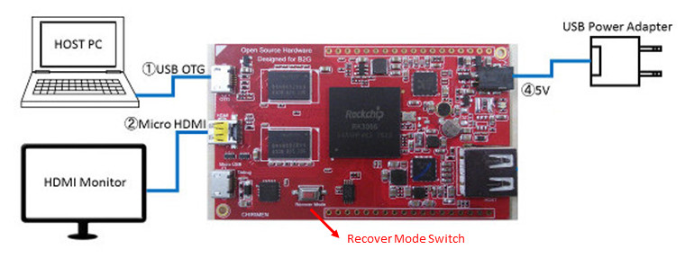
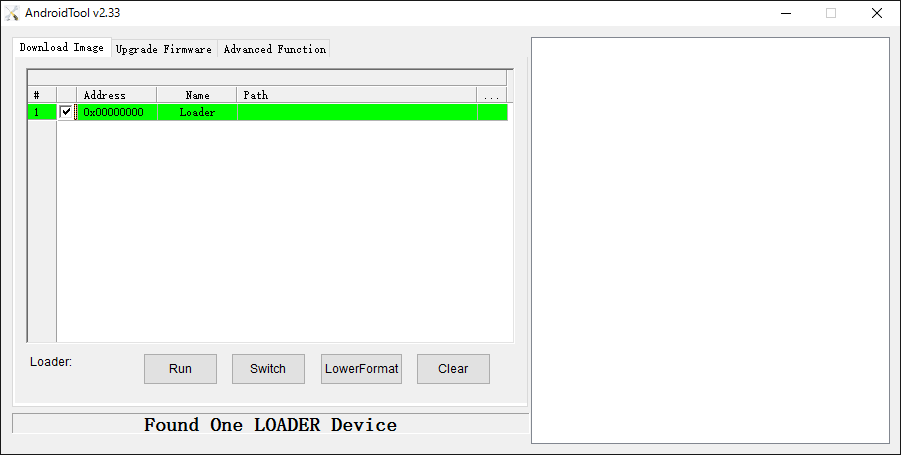
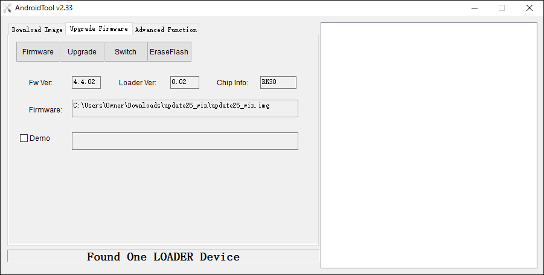
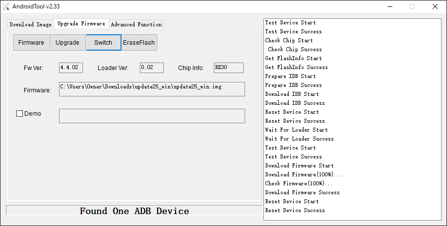

# Firmware Update Guide for Windows

## Outline
This page explains an update procedure for the operating system of a CHIRIMEN board computer . OS of host PC is Windows.

## Required equipments
- CHIRIMEN Board Computer
- HDMI monitor (In order to display the output of CHIRIMEN )
- HDMI cable (It is attached to the typical CHIRIMEN package. )
- USB power cable for CHIRIMEN  (It is attached to the typical CHIRIMEN package. )
- USB power source with the electric-current supply capacity of more than 1A      

### Connection diagram
 

## Software which should be installed in host PC
- USB driver for CHIRIMEN
  - It should be installed using [DriverAssistant_v4.1.1.zip](https://github.com/MozOpenHard/CHIRIMEN-tools/blob/master/DriverAssistant_v4.1.1.zip).   
The special USB driver only for A firmware update is required.
- AndroidTool v2.33
  - It is included in [AndroidTool_v2.33.zip](https://github.com/MozOpenHard/CHIRIMEN-tools/blob/master/AndroidTool_v2.33.zip).

### Of course, the following data is required on host PC.
- The firmware image of CHIRIMEN (In this example of description, it assumes that it is a file called update25_win.img. )

## Step by step guide
Here, an installation procedure has been explained.

- Install a driver using [DriverAssistant_v4.1.1.zip](https://github.com/MozOpenHard/CHIRIMEN-tools/blob/master/DriverAssistant_v4.1.1.zip).
- Excluding USB Power Adapter, connect the components as per the connection diagram.  
NOTE: Don't turn on CHIRIMEN yet at this time.
- Open the device manager of Windows.
- Pressing "Recover Mode Switch", connect USB Power Adapter as it is, and boot up CHIRIMEN.
- Check that the following devices have appeared in the device manager.  
 
- Launch AndroidTool  
- Check being displayed on the part under it as "Found One LOADER Device".
   
NOTE: On occasions when it is displayed as "Found One ADB Device", pull out USB Power Adapter while  pressing Recover Mode Switch. Connect USB Power Adapter again and reboot CHIRIMEN.
- Open a Upgrade Firmware tab, push the Firmware button and load the firmware image of CHIRIMEN.   
   
NOTE: If registration of Firmware is performed normally, the path of the file specified as Firmware Text Box will be displayed.
- Push the Upgrade button and start firmware update.
  - The progress status of update is displayed on right Text Box.
  - If a "Download Firmware Success" message appears, Update is successful!  
 
- Update Process is COMPLETED!

