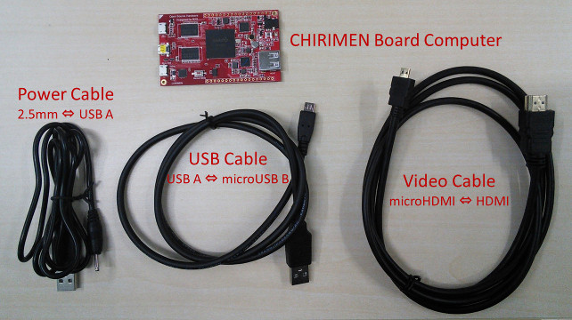
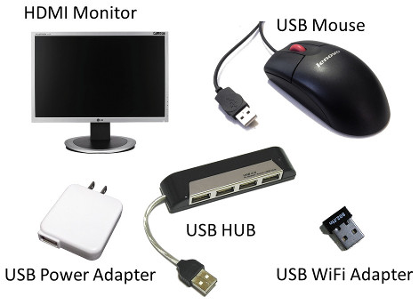
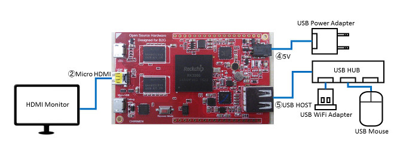
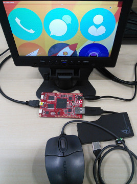

# 起動編

## 概要
CHIRIMENは、ウェブコンテンツやウェブアプリの表示・実行ができると同時に、様々な低レベルのデバイスを自由に接続しウェブアプリから制御できるボードコンピュータです。 
本編ではCHIRIMENの起動とウェブブラウザとしての基本動作を確認します。低レベルデバイスの接続やコントロールは、開発環境準備編と、Hello Real World編を参照してください。

## 必要な機材
この基本動作の確認に必要なハードウェア要素は以下です。 

- CHIRIMENボード本体
- HDMIモニター (CHIRIMENの出力を表示するため)
- HDMIケーブル (典型的なCHIRIMENパッケージに添付)
- CHIRIMEN用USB電源ケーブル (典型的なCHIRIMENパッケージに添付)
- USB電源(1A以上の電流供給能力が必要)
- USBマウス

### WiFi接続のために必要な追加機材 (Optional)
加えて、WWWにCHIRIMENを接続したアプリケーションを開発するためには、以下が必要です。 

- USBドングル型のWiFiアダプタ
  - WiFiアダプタは、2016年2月現在のビルドでは、RTL8188CUS, RTL8188RU, RTL8192CUのいずれかのチップセットを搭載したものが動作するかもしれません。(要確認) (動作確認リスト)
  - GW-USNANO2A など
- USBハブ

### 機材のイメージ
典型的なCHIRIMENのパッケージを入手すると、以下が同梱されているでしょう。
 

必要な追加の機材の典型的なイメージを以下に紹介します。
 

## 接続図
ハードウェアの接続図は下記のとおりです。
 

例えば、次の写真のように接続されるでしょう。

 

## 起動手順

- CHIRIMEN本体を木やプラスチックなど、電気を通さないものに固定します。
- まず、USB電源を除くすべての接続を接続図の通り行ってください。
- なお、WiFiを試さない場合はUSB HOST端子に直接マウスを接続しても構いません。
- HDMIモニターの電源を投入してください。
- 最後にUSB電源を投入してください。
- Boot to Gecko OSの起動画面があらわれた後、しばらくするとBoot to Geckoのデスクトップ画面が表示されます。

以上で基本動作の確認は完了です。