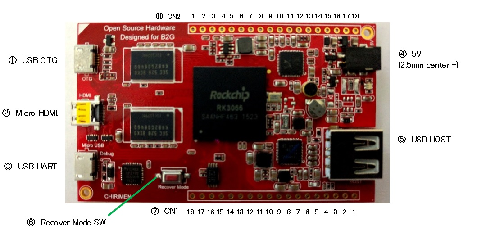

# ボードコンピュータ　コネクタ配置
CHIRIMENボードコンピュータのコネクターおよびスイッチの配置を紹介します。

## コネクタ配置図

 

 

1. USB OTG  
開発用ホストコンピュータを接続するためのMicroUSB Type BのUSBポートです
1. Micro HDMI type video connector  
HDMIビデオモニタを接続するためのコネクタです
1. USB UART
この端子は、多くのケースで使用しません。SoCが搭載するUARTxポートをUSBに変換した信号が出力されます。
1. 5V power in  
5Vの電源の入力コネクタです。外径2.5mmのDCコネクタです。
1. USB HOST  
ネットワークアダプタやポインティングデバイスなどを接続するためのUSB Type Aポートです。
1. Recover mode switch  
ファームウェアのアップデートのために主に使用するスイッチです。
1. CN1 (Connector1)  
GPIO, I2C, UART, SPIなどの信号が集約されたスルーホールの多用途入出力端子です。端子の信号配置図は後の章を参照してください。
1. CN2  (Connector2)  
もうひとつの多用途入出力端子です。
1. Micro SD Slot  
MicroSDスロットです。2016年2月現在まだOSはサポートしていません。

## 多用途入出力端子のピン配置
多用途入出力端子のピン（CN1、CN2）の特徴
- Through Hole
- Pitch : 2.54mm
- GPIO voltage : 3.3V

ピンヘッダを半田付けする前のテスト用には、先端がバネになっているタイプのジャンパワイヤ（例えば[TTW-200](https://www.amazon.co.jp/%E3%82%B5%E3%83%B3%E3%83%8F%E3%83%A4%E3%83%88-TTW-200-%E3%82%B9%E3%83%AB%E3%83%9B%E3%83%BC%E3%83%AB%E7%94%A8%E3%83%86%E3%82%B9%E3%83%88%E3%83%AF%E3%82%A4%E3%83%A4/dp/B00J7LFHVU)）がおすすめです。

Note: Currently UART, SPI and PWM are re-assigned to GPIO.

||CN1 (Connector1)|||
|------------|:--:|:----------------:|:----------------:|
|Number|Description (sysfs name)|Drive|Pull up/down|
|1|GND|N/A|N/A|
|2|I2C-2 SDA|8mA|UP|
|3|I2C-2 SCL|8mA|UP|
|4|GPIO-3 D3 (gpio283)|8mA|UP|
|5|GPIO-3 D4 (gpio284)|8mA|DOWN|
|6|ADC-0 in|N/A|N/A|
|7|GPIO-1 A4 (gpio196)|8mA|UP|
|8|GPIO-1 A5 (gpio197)|8mA|DOWN|
|9|GPIO-1 A6 (gpio198)|8mA|UP|
|10|GPIO-1 A7 (gpio199)|8mA|UP|
|11|GPIO-1 C4 (gpio244)|8mA|DOWN|
|12|GPIO-1 C3 (gpio243)|4mA|DOWN|
|13|GPIO-1 C6 (gpio246)|8mA|DOWN|
|14|GPIO-1 C5 (gpio245)|8mA|DOWN|
|15|GND|N/A|N/A|
|16|VCC 3.3V|N/A|N/A|
|17|VCC 3.3V|N/A|N/A|
|18|VCC 5V|N/A|N/A|

||CN2 (Connector2)|||
|------------|:--:|:--:|:----------------:|
|Number|Description (sysfs name)|Drive|Pull up/down|
|1|GND|N/A|N/A|
|2|GND|N/A|N/A|
|3|GND|N/A|N/A|
|4|GND|N/A|N/A|
|5|Audio L out|N/A|N/A|
|6|Audio R out|N/A|N/A|
|7|Audio L in|N/A|N/A|
|8|Audio R in|N/A|N/A|
|9|Audio GND|N/A|N/A|
|10|GPIO-0 A3 (gpio163)|8mA|DOWN|
|11|I2C-0 SCL|8mA|UP|
|12|I2C-0 SDA|8mA|UP|
|13|GPIO-0 A1 (gpio193)|8mA|UP|
|14|GPIO-0 A0 (gpio192)|8mA|DOWN|
|15|GPIO-6 A1 (gpio353)|8mA|UP|
|16|Power ON|N/A|N/A|
|17|GND|N/A|N/A|
|18|VSYS 5V|N/A|N/A|

下記のリンクも参照ください。
- [CHIRIMEN schematic](https://github.com/chirimen-oh/release/blob/master/hardware/CMN2015-1_schematic.pdf)
- [RK3066 datasheet](http://rockchip.fr/RK3066%20datasheet%20V1.0.pdf)

<!-- (ORIGINAL) 
||CN1 (Connector1)| |CN2 (Connector2)|
|------------|:--:|:----------:|:----------------:|
|Number|Description| |Description
|1|GND| |GND|
|2|I2C-2 SDA| |GND|
|3|I2C-2 SCL| |GND|
|4|UART-3 RX| |GND|
|5|UART-3 TX| |Audio L out|
|6|ADC-0 in| |Audio R out|
|7|SPI-0 CS| |Audio L in|
|8|SPI-0 CLK| |Audio R in|
|9|SPI-0 RX| |Audio GND|
|10|SPI-0 TX| |PWM-0|
|11|SPI-1 CS| |I2C-0 SCL|
|12|SPI-1 CLK| |I2C-0 SDA|
|13|SPI-1 RX| |UART-0 TX|
|14|SPI-1 TX| |UART-0 RX|
|15|GND| |GPIO-6 A1|
|16|VCC 3.3V| |Power ON|
|17|VCC 3.3V| |GND|
|18|VCC 5V| |VSYS 5V|
-->
