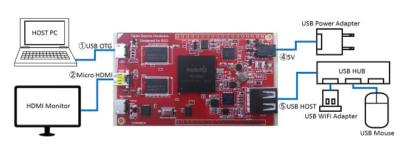

# 開発環境準備編 windows版

## 概要
現在のCHIRIMENは、Boot to Gecko OSベースのボードコンピュータです。そこで、その開発には、B2G端末のための開発環境を用いることになります。開発ではホストPC上のFirefoxに搭載されたWebIDEを用います。さらに補助的に同じくホストPC上のADB(Android Debug Bridge)を用います。そのため、開発環境の準備として、CHIRIMENをホストPC上のFirefox WebIDEから認識できるようにします。  
このガイドはWindows PCをホストコンピュータとして用いた場合の、CHIRIMEN開発環境の準備方法を紹介します。

## 必要機材
この開発環境に必要なハードウェア要素は、起動編で用いたすべての機材に加えて、以下が必要です。

- Windows PC (7以上を推奨)
- USBケーブル (典型的なCHIRIMENパッケージに付属)

### ハードウェア構成図
 

## ホストPCに必要なソフトウェア
- Firefox
  - ADB Helperアドオン
  - ツールアダプタアドオン
- ADB(Android Debug Bridge)ツール
  - Java (JREも可)
  - Android SDK Tools (ADBツールをインストールするマネージャ)
- CHIRIMEN用USBドライバ
  - Windows 10 Ver.1511では初めから備わっています
  - それ以前のWindowsでは、DriverAssistant_v4.1.1.zip を使ってインストールします。
  
## ステップバイステップガイド
以下、順を追ってインストール手順を説明します。

### USBドライバのインストール
- Windowsのデバイスマネージャを起動
- CHIRIMENを起動（起動編に沿って起動します）
- CHIRIMENをホストPCにUSBで接続
- Windows10 Ver1511以降
  - USB Device としてCHIRIMENが自動認識される(デバイスマネージャで確認)
- それ以外のWindows
  - デバイスマネージャにはデバイスドライバーがインストールされていないデバイスとしてほかのデバイス/CHIRIMENが現れる。
  - [DriverAssistant_v4.1.1.zip](https://github.com/MozOpenHard/CHIRIMEN-tools/blob/master/DriverAssistant_v4.1.1.zip)をDLし解凍
  - デバイスマネージャで、デバイスドライバーがインストールされていないデバイス CHIRIMENを選択し、ドライバーの更新
  - 上記解凍したフォルダ(とそのサブフォルダ)を指示するしてドライバをインストールすることで、Android Device / Android Composite ADB interfaceとして認識する

### ADB(Android Debug Bridge)を使えるようにする
- jdk(少なくともjre)をインストール　[ここ](http://www.oracle.com/technetwork/java/javase/downloads/index.html)　もしくは[ここ](https://java.com/ja/download/)
- Android SDK Tools Onlyをインストール(Android Studioは必要以上。)  
[Other Download Options](http://developer.android.com/sdk/index.html#Other)でAndroid SDK Tools Onlyを選択できる
- SDK Managerを起動  
注：Andorid SDKを just for meではなく for anyoneでインストールした場合は、SDK Managerを管理者モードで起動
- Android SDK Platform-tools をインストール
- Platform-toolsのadb.exeの場所をWindowsのPATHに設定
- 以下の動作を確認する。
  - コマンドプロンプトで　adb shell[ret]とすると、CHIRIMENにログインできる
  
### Firefox WebIDEでCHIRIMENを認識させる
注：WebIDEは ADBの機能を利用してB2G OSコンピュータであるCHIRIMENを制御します。したがって、必ず前章のADBでCHIRIMENが操作できる状態にしてください。

- 最新版にアップデートされたFirefoxを起動
- ツール/開発ツール/WebIDE を選択
- 右上の USBデバイス の項目下の、ADB Helperをインストール を選択
  - ADB Helperアドオン
  - ツールアダプタアドオン  
の２つをインストール
- Firefoxを再起動
- 以下の動作を確認する。
  - ツール/開発ツール/WebIDEの右上のUSBデバイス欄にCHIRIMENが現れる
  - CHIRIMENを選択すると、WebIDE左側にランタイムアプリ一覧などが出現する

以上で基本的な開発環境の準備は完了です。

## 参考文献
- [Firefox OS端末をコンピュータに接続する](https://developer.mozilla.org/ja/Firefox_OS/Debugging/Connecting_a_Firefox_OS_device_to_the_desktop)
- [ADBをインストールして使用する](https://developer.mozilla.org/ja/Firefox_OS/Debugging/Installing_ADB)
- [Java(JDK)とAndroid SDKを導入してADBコマンドを使えるようにする](http://andmem.blogspot.jp/2014/04/installjdkandroidsdkadb.html)
