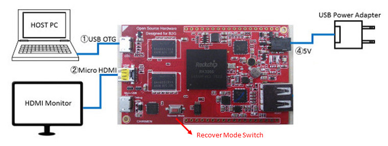

# Firmware Update Guide for Linux(Ubuntu)

## 概要
CHIRIMENボードコンピュータのオペレーティングシステムをアップデート手順を解説します。ホストPCのOSはLinux(Ubuntu)です。

## 必要な機材
- CHIRIMENボード本体
- HDMIモニター (CHIRIMENの出力を表示するため)
- HDMIケーブル (典型的なCHIRIMENパッケージに添付)
- CHIRIMEN用USB電源ケーブル (典型的なCHIRIMENパッケージに添付)
- USB電源(1A以上の電流供給能力が必要)

### ハードウェア構成図


## Ubuntu version
- OS version の確認

  ```
  $ cat /etc/lsb-release
  DISTRIB_ID=Ubuntu
  DISTRIB_RELEASE=16.04
  DISTRIB_CODENAME=xenial
  DISTRIB_DESCRIPTION="Ubuntu 16.04.1 LTS

  $ arch
  X86_64
  ```

## ステップバイステップガイド
以下、順を追ってインストール手順を説明します。

### Ubuntuでの操作
- Ubuntuの端末（terminal）を起動します。
- 以下の手順は、基本的に端末（terminal）で行います。


### github から CHIRIMEN-toolsリポジトリをクローンします。
  ```
  $ git clone https://github.com/chirimen-oh/CHIRIMEN-tools.git
  ```
  

### 最新イメージを取得します。
- 下記コマンド実行します。

  ```
  $ wget https://github.com/chirimen-oh/release/releases/download/CMN2015-1/CMN2015-1_B2GOS-2016XXXX.zip
  ```

  ```
  ※2016XXXX：バージョン
  ```
  


### 最新イメージを解凍／展開します。
- 下記コマンド実行します。

  ```
  $ unzip CMN2015-1_B2GOS-2016XXXX.zip
  ```

  ```
  ※解凍／展開されるとCMN2015-1_B2GOS-2016XXXX.img が作成されます。
  ```

  ```
  ※2016XXXX：バージョン
  ```
  

### ルールを設定します。
- ルールファイル（51-android.rules）の作成を行います。
  - 下記コマンド実行します。

    ```
    $ sudo vi /etc/udev/rules.d/51-android.rules
    ```
    
- ルールファイル（51-android.rules）の編集を行います。
  - 下記内容を入力します。

    ```
    SUBSYSTEM=="usb", ATTR{idVendor}=="2207", MODE="0666",GROUP="plugdev”
    ```
    

### 設定を反映をします。
- 下記コマンド実行します。

  ```
  $ sudo udevadm control --reload
  ```
  

### CHIRIMEN BoardをPCとディスプレイに接続します。
- OTG と印字されたコネクタにUSBケーブルをPCに接続します。
- HDMI と印字されたコネクタにHDMIケーブルをディスプレイに接続します。

### CHIRIMEN Boardを書き込みモードで起動します。
- Recover Mode Switchを押しながら電源接続し、起動します。

### CHIRIMEN Boardをファーム書き込みコマンドを実行します。
- 下記コマンド実行します。

  ```
  $ ./CHIRIMEN-tools/Linux_Upgrade_Tool_v1.21/upgrade_tool uf CMN2015-1_B2GOS-2016XXXX.img
  ```

  ```
  ※2016XXXX：バージョン
  ```
  
  
  
  
  

### CHIRIMEN Boardの再起動待ち
- 以上でアップデート工程は完了しました。

