# Firmware Update Guide for mac(Virtualbox)

## 概要
CHIRIMENボードコンピュータのオペレーティングシステムをアップデート手順を解説します。ホストPCのOSはmac(Virtualbox)です。

## 必要な機材
- CHIRIMENボード本体
- HDMIモニター (CHIRIMENの出力を表示するため)
- HDMIケーブル (典型的なCHIRIMENパッケージに添付)
- CHIRIMEN用USB電源ケーブル (典型的なCHIRIMENパッケージに添付)
- USB電源(1A以上の電流供給能力が必要)

### ハードウェア構成図


## Ubuntu 仮想環境構築
### 下記urlからUbuntu 仮想環境 vdi ファイルをダウンロードします。

  - [Ubuntu 仮想環境 vdi ファイル](https://drive.google.com/drive/folders/0B4V6iMhRJyKObjV3bmZDZVN4d1k)

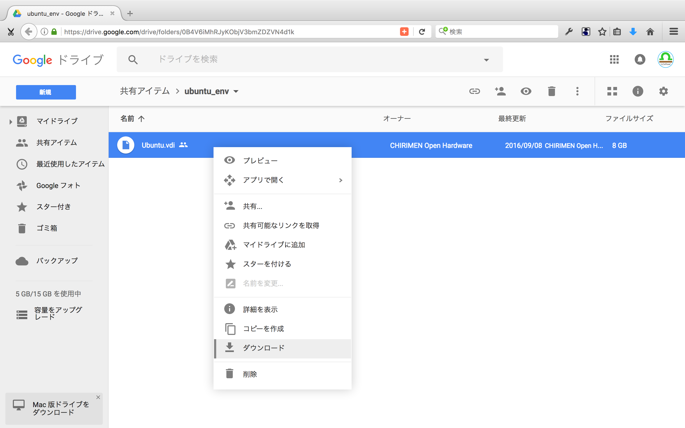

### Virtualbox 選択します。
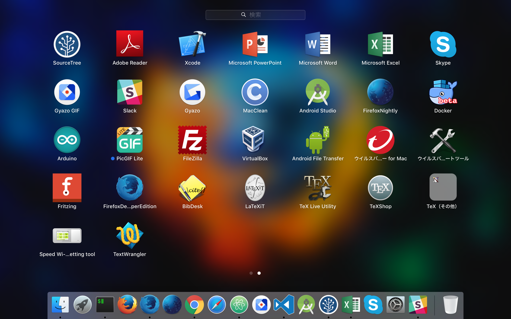

### Virtualbox 起動します。
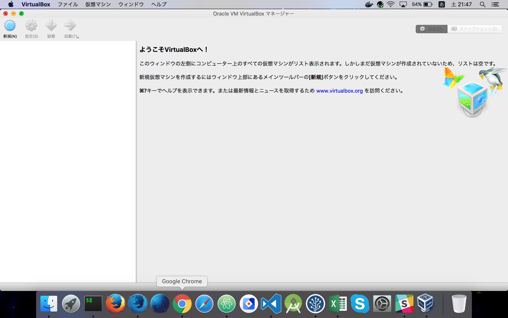

### Virtualbox で 仮想環境を新規作成します。
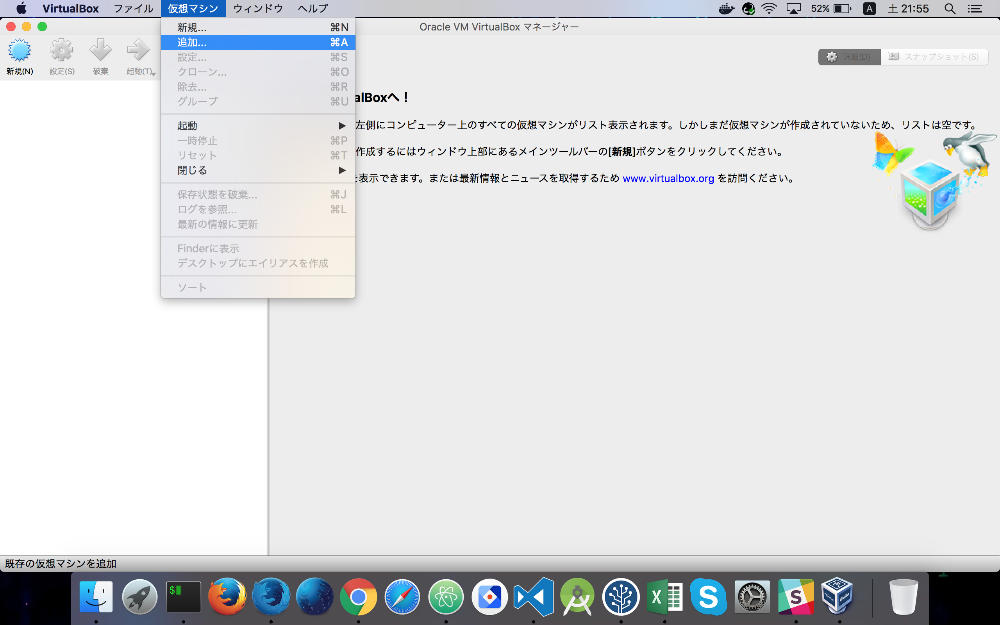

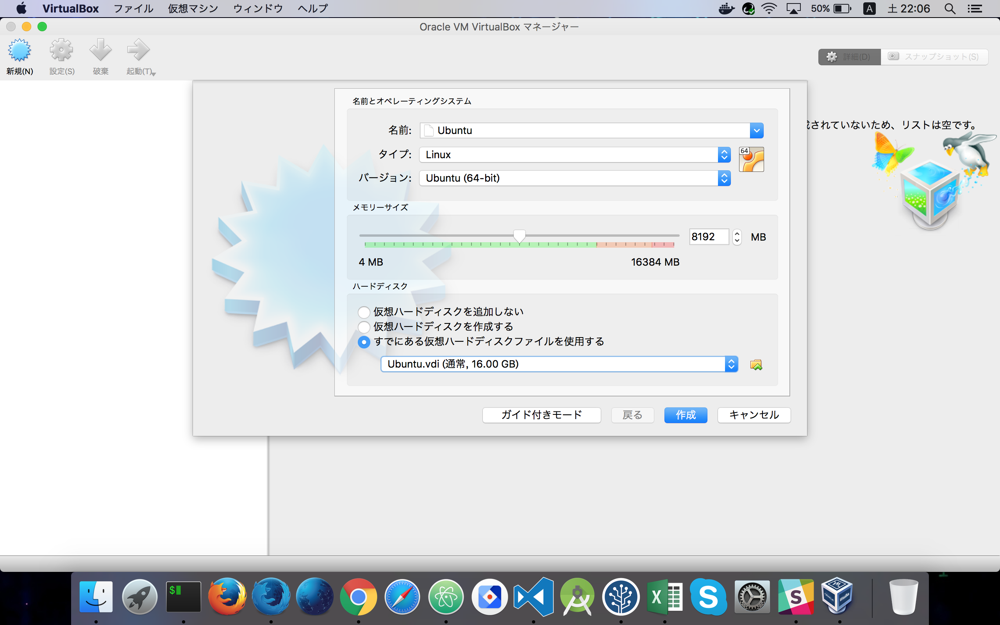

### ダウンロードした vdi ファイルを選択します。


### 仮想環境が出来ました。
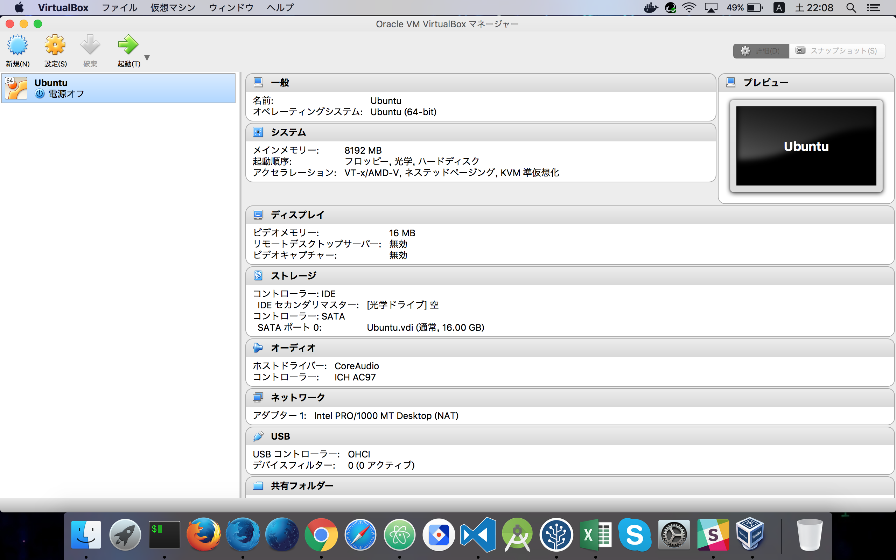

### 仮想環境の Ubuntu を起動します。
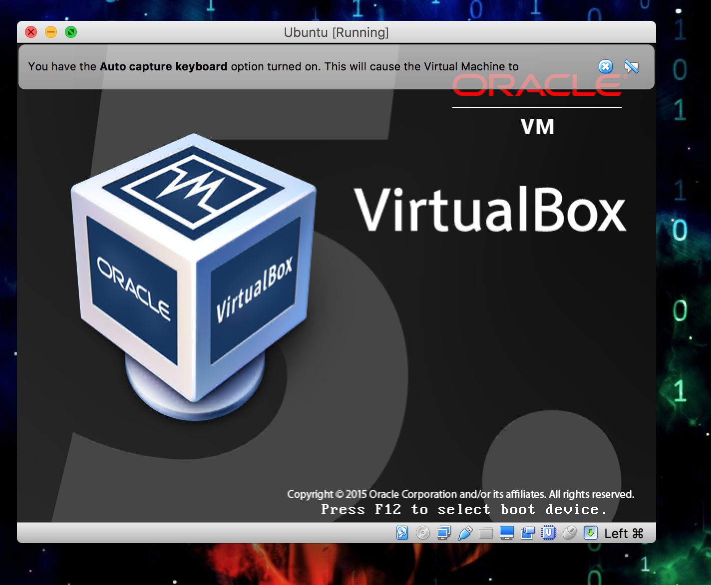

### パスワード：「chirimen」と入力します。
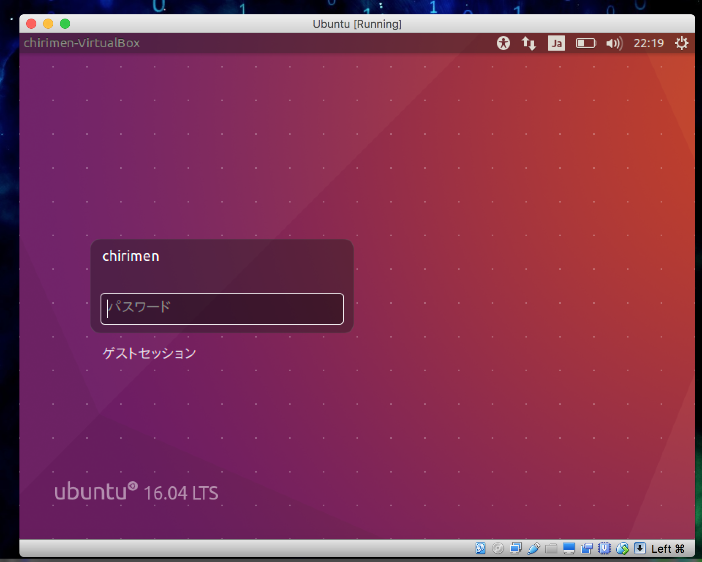

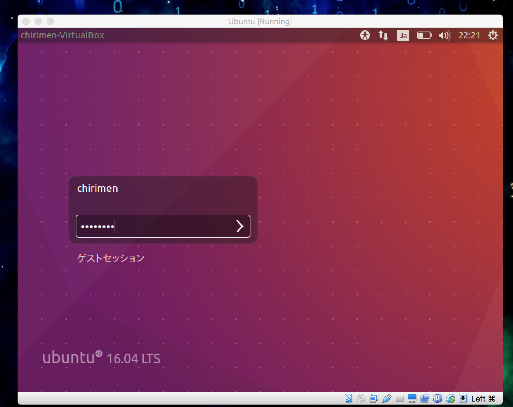

## ステップバイステップガイド
以下、順を追ってインストール手順を説明します。

### Ubuntuでの操作
- Ubuntuの端末（terminal）を起動します。
- 以下の手順は、基本的に端末（terminal）で行います。

### 最新イメージを取得します。
- 下記コマンド実行します。

  ```
  $ wget https://github.com/chirimen-oh/release/releases/download/CMN2015-1/CMN2015-1_B2GOS-2016XXXX.zip
  ```

  ```
  ※2016XXXX：バージョン
  ```
  


### 最新イメージを解凍／展開します。
- 下記コマンド実行します。

  ```
  $ unzip CMN2015-1_B2GOS-2016XXXX.zip
  ```

  ```
  ※解凍／展開されるとCMN2015-1_B2GOS-2016XXXX.img が作成されます。
  ```

  ```
  ※2016XXXX：バージョン
  ```
  


### CHIRIMEN BoardをPCとディスプレイに接続します。
- OTG と印字されたコネクタにUSBケーブルをPCに接続します。
- HDMI と印字されたコネクタにHDMIケーブルをディスプレイに接続します。

### CHIRIMEN Boardを通常モードで起動します。
- 電源接続し、起動します。
- Virtualbox の USB 設定を行います。
  - Virtualbox VM の Menu -> Devices -> USB
    - 画像のように [ CHIRIMEN Open Hardware chirimen [0222] ] チェックをつけてください
  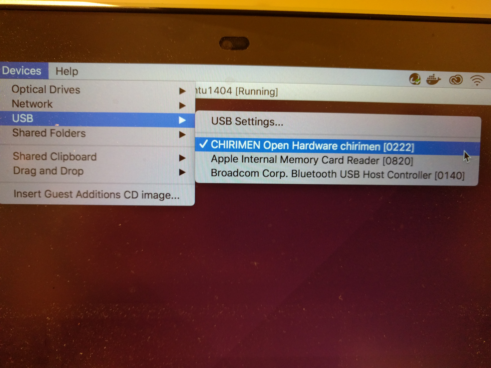
  - Virtualbox VM の Menu -> Devices -> USB -> USB Setting
  
  - USB デバイス 追加設定画面が表示されます。
  - "+"アイコンをクリックします。
  
  - 先程と同様にが表示されます。
  - 画像のように [ CHIRIMEN Open Hardware chirimen [0222] ] チェックをつけてください
  
  - USB デバイスが追加されると画像のようになります。
  

### CHIRIMEN Boardを書き込みモードで起動します。
- 電源接続を一度、抜きます。
- Recover Mode Switchを押しながら電源接続します。
- Recover Mode Switchを押した状態で、ゆっくり10数えます。
- Virtualbox の USB 設定を再度行います。
  - Virtualbox VM の Menu -> Devices -> USB
    - 画像のように [ Unknown device 2207:300A [0100] ] チェックをつけてください
  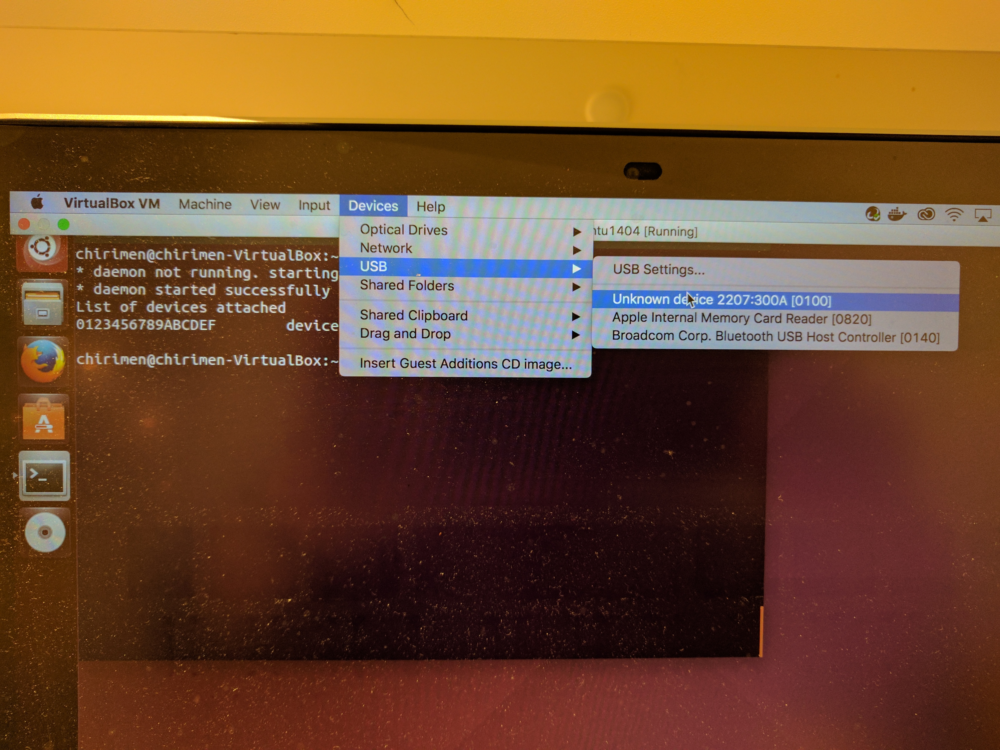
  - Virtualbox VM の Menu -> Devices -> USB -> USB Setting
  
  - USB デバイス 追加設定画面が表示されます。
  
  - "+"アイコンをクリックします。
  - 先程と同様にが表示されます。
  - 画像のように [ Unknown device 2207:300A [0100] ] チェックをつけてください
  
  - USB デバイスが追加されると画像のようになります。
  


### CHIRIMEN Boardをファーム書き込みコマンドを実行します。
- 下記コマンド実行します。
  - sudo 無しでも実行できますが、確実性を上げるためにsudoを用いています。
  - 本手順では、画像の様にCHIRIMEN-toolsフォルダ内にimgファイルがあるものとして、手順を進めます。

  ```
  $ sudo ./Linux_Upgrade_Tool_v1.21/upgrade_tool uf CMN2015-1_B2GOS-20170301.img
  ※20170301：バージョン
  ```


  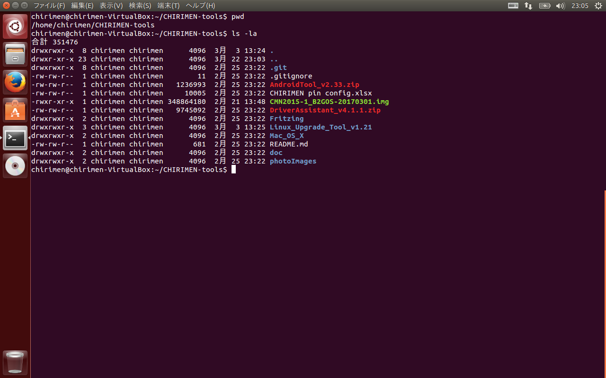
  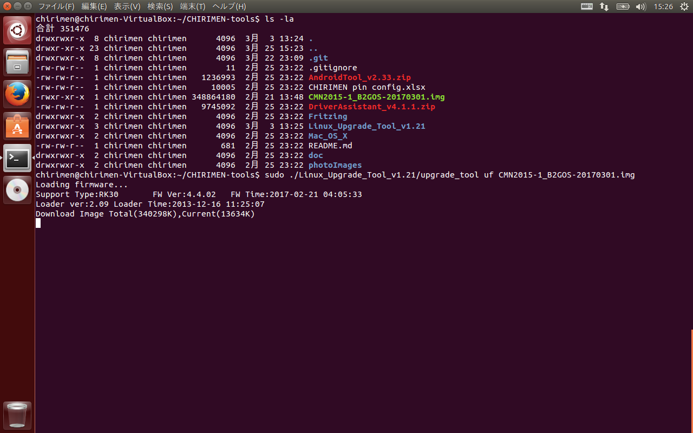

### CHIRIMEN Boardの再起動待ち
- 以上でアップデート工程は完了しました。
  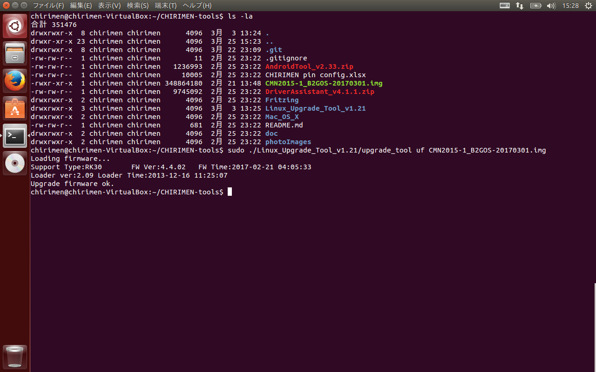
