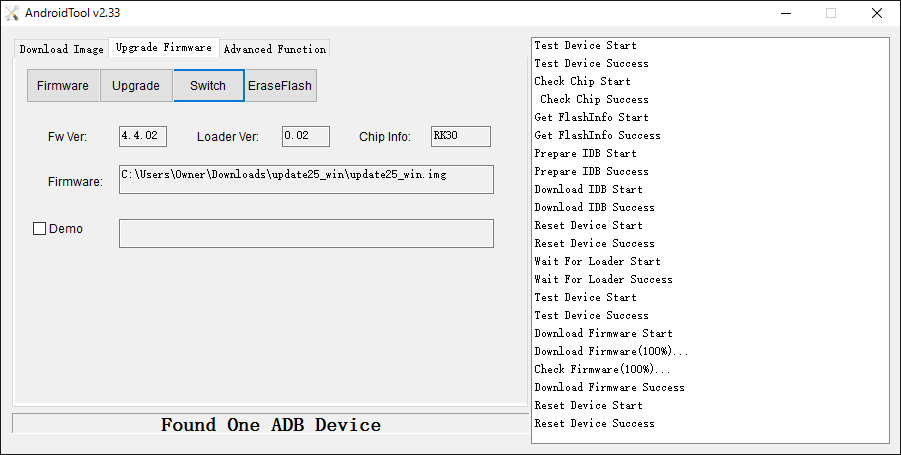

# Firmware Update Guide for Windows

## 概要
CHIRIMENボードコンピュータのオペレーティングシステムをアップデート手順を解説します。ホストPCのOSはWindowsです。

## 必要な機材
- CHIRIMENボード本体
- HDMIモニター (CHIRIMENの出力を表示するため)
- HDMIケーブル (典型的なCHIRIMENパッケージに添付)
- CHIRIMEN用USB電源ケーブル (典型的なCHIRIMENパッケージに添付)
- USB電源(1A以上の電流供給能力が必要)

### ハードウェア構成図
 

## ホストPCに必要なソフトウェア
- CHIRIMEN用USBドライバ
  - [DriverAssistant_v4.1.1.zip](https://github.com/MozOpenHard/CHIRIMEN-tools/blob/master/DriverAssistant_v4.1.1.zip) を使ってインストールします。  
ADBと異なるファームウェアアップデート用のUSBドライバが必要です。
- AndroidTool v2.33
  - [AndroidTool_v2.33.zip](https://github.com/MozOpenHard/CHIRIMEN-tools/blob/master/AndroidTool_v2.33.zip) に入っています。
- CHIRIMENのファームウェアイメージ（この例では、update25_win.imgというファイル）

## ステップバイステップガイド
以下、順を追ってインストール手順を説明します。

- [DriverAssistant_v4.1.1.zip](https://github.com/MozOpenHard/CHIRIMEN-tools/blob/master/DriverAssistant_v4.1.1.zip) を使って、ドライバをインストールします。
- USB Power Adapterを除く全てを構成図に従って接続します。  
この時点ではまだCHIRIMENの電源は入れません。
- Windowsのデバイスマネージャを開きます。
- Recover Mode Switchを押しながら、そのままUSB Power Adapterを接続してCHIRIMENを起動します。
- 以降の作業はすべてホストPCでの作業です。
- デバイスマネージャに以下のようなデバイスが出現したことを確認します。  
 
- AndroidToolを起動します。  
下の部分に"Found One LOADER Device"と表示されていることを確認します。
   
注記: "Found One ADB Device"と表示される場合は、USB Power Adapterを抜き、Recover Mode Switchを押しながらUSB Power Adapterを再度接続して起動しなおします。
- Upgrade Firmwareタブを開き、Firmwareボタンを押し、CHIRIMENのファームウェアイメージ（この例では、update25_win.imgというファイル）をロードします。  
   
注記：正常にFiremwareの登録ができると、Firmware Text Boxに指定したファイルのパスが表示されます。登録できない場合は表示されません。
- Upgradeボタンを押すとアップデートが開始されます。
  - 右のText Boxにアップデートの進捗状況が表示されます。
  - Download Firmware Successメッセージが出現すればアップデート成功です。  
 
- 以上でアップデート工程は完了しました。
